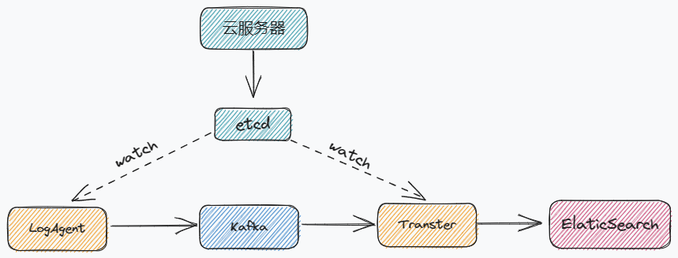

# 日志收集系统

## 项目整体架构
LogAgent 部署到需要收集日志的服务器，收集日志发送到 KafKa

Transfer 读取日志，发送到 ElasticSearch 分系日志

>LogAgent 和 Transfer 是本次开发的项目

通过 etcd 做配置管理，LogAgent 和 Transfer 监听 etcd 中定义的配置，若 etcd 中的配置发生变化，会实时通知 LogAgent 和 Transfer
## LogAgent
日志收集客户端，用来收集服务器上的日志